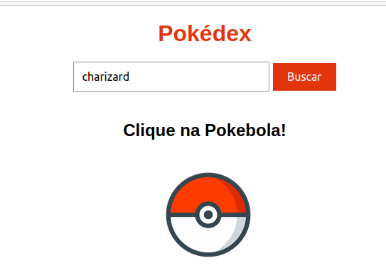
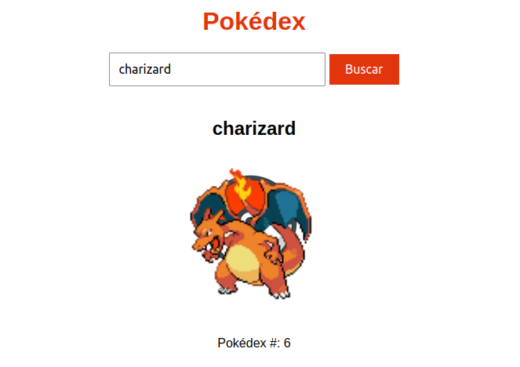

# pokeAPI_front
Frontend básico com HTML e CSS que faz o consumo da API PokéAPI, exibindo o nome do pokemon, sprite default de frente e numeração na pokédex. Form input simples de busca pelo nome do Pokemon.

## O que esperar:
 

